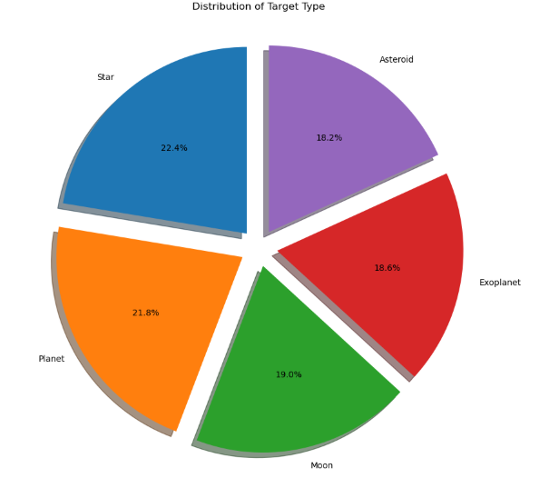
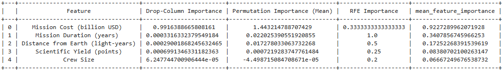

# Capstone-1_ML_ZoomCamp_2024

# Project Overview:

### Space Mission Prediction:
Predicting the success rate of space missions using machine-learning models. 
This project explores various models to analyze and predict factors influencing the success of space missions. 
By leveraging features such as mission cost, duration, and distance from Earth,the models aim to provide actionable insights for optimizing mission planning and resource allocation. 

**Source**: The data is sourced from the Space Missions Dataset on Kaggle. [Kaggle - Space Missions Dataset](https://www.kaggle.com/datasets/sameerk2004/space-missions-dataset)

<div align="center">
    
</div>

# Problem Description: 

Space missions involve significant complexity and high costs, making their success crucial for scientific advancement and resource efficiency. 
Accurately predicting the success rate of missions is essential for informed decision-making and risk management. 
This project leverages historical space mission data to identify critical factors driving mission success, enabling a data-driven approach to optimize planning and execution.

The goal is to develop a machine-learning model that can accurately predict mission success percentages based on 
features like mission cost, duration, distance from Earth, and scientific yield.
This solution has the potential to optimize decision-making processes in future space missions and reduce the risk of failures.

# Dataset Details: 

The dataset used in this project is the **Space Missions Dataset**, sourced from Kaggle. It contains over 500 records, with detailed information on historical space missions.

### **Key Features:**
- **Mission Type:** The type of the mission (e.g., Scientific, Commercial, Military, etc.).
- **Mission Cost (billion USD):** The total cost of the mission.
- **Mission Success (%):** The success rate of the mission, given as a percentage.
- **Distance from Earth (light-years):** Distance to the mission's target.
- **Scientific Yield (points):** The scientific outcome of the mission.
- **Mission Duration (years):** Duration of the mission in years.
- **Crew Size:** The number of astronauts involved in the mission.
  
<div align="center">
    
</div>

# EDA (Exploratory Data Analysis):

Exploratory Data Analysis (EDA) was conducted to gain a deeper understanding of the dataset, uncover relationships between features, identify anomalies, and prepare the data for modeling. 
Below are the key steps and insights derived during the analysis:

### Key Steps:
1. **Handling Missing Values and Dropping Unnecessary Columns:**
   - Checked for missing values across all features and handled them.
   - Dropped unnecessary columns that were irrelevant to the analysis.

2. **Outlier Detection and Removal:**
   - Detected and removed outliers using the Interquartile Range (IQR) method to improve model robustness and accuracy.

3. **Descriptive Statistics:**
   - Calculated summary statistics (mean, median, min, max, standard deviation) for numerical features to understand their distributions.

4. **Correlation Analysis:**
   - Generated a correlation heatmap to identify relationships between numerical features and their potential impact on mission success.

5. **Visualization of Distributions:**
   - Utilized various visualizations, including:
     - **Histograms** and **boxplots** for numerical feature distributions.
     - **Pie charts** to analyze target type distribution.
     - **Bar plots** and **countplots** for categorical features.
     - **Scatter plots** for relationships between numerical variables.
     - **Bar charts** for visualizing top mission names.

6. **Feature Importance Analysis:**
   - Analyzed feature importance using multiple techniques:
     - **Regression model coefficients**
     - **Recursive Feature Elimination (RFE)**
     - **Permutation Importance**
     - **Drop-Column Importance**

### Visual Insights:
1. **Mission Success Distribution:**  
   - Visualized the distribution of target types using a pie chart.
     
   

2. **Feature Importance:**  
   - Displayed feature importance scores derived from various analysis methods.
     
   

### Outcome:
EDA provided critical insights into the dataset, including feature relationships and distributions, enabling effective feature engineering and selection. 
These insights laid the foundation for robust and accurate predictive modeling.

# Model Training & Tuning:

In this project, multiple machine-learning models were trained and tuned to predict the success rate of space missions. 
The process included data preparation, model training, hyperparameter tuning, and evaluation.

### Key Steps:

1. **Data Splitting**:
   - The dataset was split into training, validation, and test sets:
     - **Training set**: 60% of the data.
     - **Validation set**: 20% of the data.
     - **Test set**: 20% of the data.
   - The target variable, `Mission Success (%)`, was separated from the feature set.

2. **Feature Vectorization**:
   - Used `DictVectorizer` to transform categorical features into a numerical format suitable for machine learning models.

3. **Model Training**:
   - Trained the following models:
     - **Linear Regression (with PCA)**: Reduced dimensionality using PCA before training.
     - **Ridge Regression**: Performed hyperparameter tuning to find the best `alpha`.
     - **Lasso Regression**: Tuned `alpha` values using `GridSearchCV`.
     - **Decision Tree Regressor**: Controlled overfitting by tuning `max_depth`, `min_samples_split`, and `min_samples_leaf`.
     - **Random Forest Regressor**: Trained an ensemble of decision trees to improve accuracy and generalization.
     - **XGBoost Regressor**: Tuned hyperparameters like `n_estimators`, `max_depth`, and `learning_rate`.
     - **Gradient Boosting Regressor**: Focused on minimizing error across iterations.
     - **Neural Networks**: Trained multiple architectures with varying numbers of layers, dropout rates, and optimizers using Keras Tuner.

4. **Evaluation Metrics**:
   - Models were evaluated using the following metrics:
     - **RMSE**: Root Mean Squared Error.
     - **MAE**: Mean Absolute Error.
     - **R²**: Coefficient of Determination.
   - These metrics provided insights into the accuracy and generalization of the models.

### Model Performance Comparison:

| Model              | RMSE       | R² Score   | MAE       |
|---------------------|------------|------------|-----------|
| Linear Regression   | 5.018050   | 0.746838   | 3.940017  |
| Ridge Regression    | 4.973625   | 0.751300   | 3.901738  |
| Lasso Regression    | 4.943223   | 0.754331   | 3.875212  |
| Decision Tree       | 5.096540   | 0.738856   | 3.217941  |
| Random Forest       | 4.420864   | 0.803509   | 2.864930  |
| XGBoost             | 4.708620   | 0.777097   | 3.381264  |
| Gradient Boosting   | 4.281393   | 0.815711   | 2.852651  |


### Hyperparameter Tuning:

1. **Ridge and Lasso Regression**:
   - Tuned the `alpha` parameter using `GridSearchCV`.
   - Optimal `alpha` values:
     - Ridge: 1000.0
     - Lasso: 10.0

2. **Neural Networks**:
   - Used **Keras Tuner** for hyperparameter tuning.
   - Tuned parameters include:
     - Number of units per layer.
     - Dropout rates.
     - Optimizers (`adam`, `rmsprop`, `sgd`).

### Key Insights:

- The **Gradient Boosting Regressor** provided the best performance with an RMSE of 4.28, MAE of 2.85, and R² of 0.81.
- **Random Forest** was a close second, showcasing strong generalization capabilities.
- The **Neural Network** model demonstrated moderate performance but required further tuning for improvement.

# Exporting Notebook to Script:

To improve modularity and reproducibility, the logic from the Jupyter Notebook was exported into separate Python scripts. 
This allows for more efficient development, debugging, and execution. Below is the structure of the exported scripts:

### Structure of Scripts:
1. **`preprocessing.py`**:
   - Handles data loading, cleaning, and preprocessing steps.
   - Removes unnecessary columns, handles missing values, and prepares data for modeling.

2. **`eda.py`**:
   - Performs exploratory data analysis (EDA).
   - Includes visualizations such as histograms, correlation heatmaps, and feature distributions.

3. **`feature_importance.py`**:
   - Analyzes feature importance using multiple methods (RFE, permutation importance, drop-column importance).
   - Saves results to assist in feature selection.

4. **`train_model.py`**:
   - Trains multiple machine learning models, including Linear Regression, Ridge, Lasso, Random Forest, XGBoost, and Gradient Boosting.
   - Includes hyperparameter tuning and saves the best-performing model.

5. **`evaluate_model.py`**:
   - Evaluate the trained models using metrics such as RMSE, MAE, and R².
   - Provides insights into model performance and comparisons.
  
   To execute these scripts:
1. Prepare the data using `preprocessing.py`:
   ```bash
   python preprocessing.py

2. Perform EDA using  `eda.py`:
   ```bash
   python eda.py
   
3. Feature importance using multiple methods `feature_importance.py`:
   ```bash
   python feature_importance.py

4. Train the final model using `train_model.py`:
   ```bash
   python train_model.py

5. Evaluate the model using `evaluate_model.py`:
   ```bash
   python evaluate_model.py

# Reproducibility:

The project has been designed to ensure full reproducibility. All requirements have been met, including:

1. **Data Accessibility**:  
   Clear instructions are provided for downloading the dataset from Kaggle, ensuring all users can access the data.

2. **Independent Scripts**:  
   Each workflow stage (preprocessing, EDA, feature importance, train model, evaluate model) is modularized into separate Python scripts that can be executed independently.

3. **Reproducible Workflow**:  
   Detailed instructions are provided to run all scripts step-by-step, allowing anyone to replicate the results without issues.

This ensures the project is fully reproducible and adheres to the required standards.

# Model Deployment:

The model is deployed as a REST API using **Flask**, allowing users to send requests with input features and receive predictions. 
Below are the key steps, important parts of the code, and instructions for running the deployment.

### Key Steps in Deployment:

1. **Saving Models**:
   - The trained models are saved in `.pkl` format for easy reusability.
   - The best-performing neural network model is saved in `.keras` format for TensorFlow compatibility.

2. **Flask API**:
   - A Flask API is implemented to serve predictions.
   - The API takes input features as JSON passes them to the loaded model, and returns the predicted result.

### Prerequisites:

Before running the API, ensure the following libraries are installed:

`pip install flask`

`pip install tensorflow --upgrade`

`pip install joblib`

## Running the Flask API:

### Save the Models:
Ensure the trained models (`.pkl` and `.keras`) are saved in the project directory. These include:

- `linear_model.pkl`
- `random_forest_model.pkl`
- `gradient_boosting_model.pkl`
- `ridge_regression_model.pkl`
- `lasso_regression_model.pkl`
- `xgboost_model.pkl`
- `decision_tree_model.pkl`
- `dict_vectorizer.pkl`
- `best_nn_model.keras`

### Start the Flask Server:

Run the Flask API script (e.g., `app.py`) to start the server:

`python app.py`

# Dependency and Environment Management:

This project provides all necessary files to set up the required environment, ensuring reproducibility and ease of use.

### Files Provided:

1. **`requirements.txt`**:
   - Lists all dependencies for the project.

2. **`Pipfile`**:
   - Used for virtual environment management with `pipenv`.
   - Tracks packages and Python version.

3. **`Pipfile.lock`**:
   - Automatically generated file by `pipenv` to lock dependencies and ensure consistent installations.

# Containerization:

The application is containerized using a **Dockerfile** and based on the `python:3.9-alpine` image. This ensures that the application can run consistently across different environments.

### Dockerfile:

Here is the Dockerfile used for containerizing the application:

#### Use the Python 3.9 Alpine base image
`FROM python:3.9-alpine`

#### Set the working directory inside the container
`WORKDIR /app`

#### Copy the application code into the container
`COPY . /app`

#### Install dependencies
`RUN pip install --no-cache-dir -r requirements.txt`

#### Expose the Flask API port
`EXPOSE 5000`

#### Run the application
`CMD ["python", "app.py"]`

# Conclusion:

This project successfully demonstrates the end-to-end workflow of a machine learning pipeline, from data preprocessing and exploratory data analysis to model training, tuning, deployment, and containerization. 
By leveraging multiple machine learning models and deployment tools, the project achieves the following:

- **Insights**: Provided valuable insights into the factors affecting the success of space missions.
- **Model Performance**: Gradient Boosting Regressor emerged as the best-performing model with high accuracy and generalization capabilities.
- **Reproducibility**: Modular Python scripts ensure that the entire process can be easily reproduced and extended.
- **Deployment**: The Flask API allows seamless interaction with the trained models for real-time predictions.
- **Scalability**: Containerizing the application with Docker ensures it can run consistently across various environments.

### Next Steps:

Future enhancements to this project could include:
- Incorporating more advanced models or feature engineering techniques.
- Expanding the dataset to include additional features or records for improved accuracy.

This project demonstrates the power of machine-learning and its potential to solve complex real-world problems, paving the way for more efficient and optimized solutions.

 <div align="center">
  <h1>Aloha from Space 🌌🚀</h1>
</div>

 <div align="center">
    
</div>
